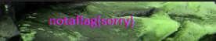
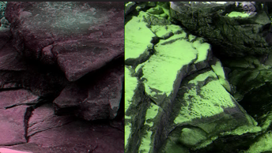

## 問題

We found this `file`. Recover the flag.

### ファイル

`tunn3l_v1s10n`

## 解法

```
file tunn3l_v1s10n
tunn3l_v1s10n: data
```

vi をバイナリモードにしてみてみる

```
vi -b tunn3l_v1s10n
:%!xxd
```

出だしが`BM`でフォーマットは BMP らしい

拡張子をつけて開いてみるけど開けない

BMP の構造を見てみる

ヘッダサイズは`40(0x28)`らしいが
今回のファイルは
オフセット:`bad0 0000`，
ヘッダサイズ:`bad0 0000`
でヘッダサイズがおかしい

`2800 0000`に直してみる

画像は開けるようになったがフラグは得られなかった

色味と画像の端が変

オフセットを直した
`bad0` -> `3600`


16:9くらいにしてみる
`1134x637`
まだ見えない
縦を800まで伸ばしたらちょっとだけ見え始めた

850まで伸ばしたら見えた